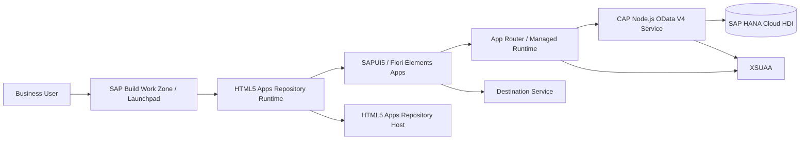

# Procure to Pay CAP Architecture for SAP BTP Launchpad / SAP Build Work Zone

## Architecture Decision

The target production architecture is:

```text
Business Users
  -> SAP Build Work Zone / Launchpad
  -> HTML5 Apps Repository Runtime
  -> SAPUI5 / Fiori Elements apps
  -> App Router or managed Launchpad runtime
  -> CAP OData V4 service
  -> SAP HANA Cloud HDI container

Cross-cutting services:
  XSUAA for authentication and role collections
  Destination service for service destinations and HTML5 runtime integration
  HTML5 Apps Repository Host for deployed UI artifacts
  HTML5 Apps Repository Runtime for Launchpad/Work Zone consumption
```

For the current repository, the practical path is:

1. Keep `P2PService` as the central OData V4 service.
2. Replace local/demo roles with BTP role collections.
3. Keep the existing custom SAPUI5 apps while adding Fiori Elements annotations and semantic-object configuration.
4. Generate separate Fiori Elements apps later from the same annotated OData V4 service if full Work Zone content federation is required.

## Current Architecture Review

### Strong Parts

- The model covers the core P2P transaction chain from PR to payment.
- Entities use `cuid` and `managed`, so technical IDs and basic audit fields are available.
- The service already exposes OData V4.
- App Router routes `/odata/*` to CAP with `forwardAuthToken`.
- Business actions exist for PR submission, PR approval, RFQ issue, PO creation, goods receipt, invoice matching, and payment execution.

### Gaps

- Role management was modeled as application data, but production BTP apps should use XSUAA role collections.
- No explicit Company Code, Plant, Purchasing Organization, Purchasing Group, Storage Location, Currency, Payment Terms, Tax Code, or UoM master entities.
- No status code master data or transition table.
- Draft support is not enabled on editable Fiori Elements projections.
- Approval workflow is implemented as direct CAP actions, not as SAP Build Process Automation / workflow tasks.
- Approver, submitted date, approved date, rejected date, approval comment, and workflow instance IDs are missing.
- Several associations are incomplete for item-level traceability, especially invoice item to PO/GR item matching.
- No attachment model for RFQ, quotation, PO, GR, invoice, or inspection evidence.
- No change document/audit log entity for business-significant status transitions.
- UI annotations are present but shallow; object pages need facets, field groups, identification, value helps, and line item annotations for compositions.

## Recommended Domain Additions

Add these master data entities before production:

- `CompanyCodes`
- `Plants`
- `StorageLocations`
- `PurchasingOrganizations`
- `PurchasingGroups`
- `MaterialGroups`
- `Currencies`
- `UnitsOfMeasure`
- `PaymentTerms`
- `Incoterms`
- `TaxCodes`
- `StatusCodes`
- `StatusTransitions`
- `ApprovalLogs`
- `Attachments`
- `VendorQuotations`
- `VendorQuotationItems`
- `InvoiceItems`

High-value associations to add:

- `Vendors.companyCode`
- `Materials.plant`
- `PurchaseRequisitions.companyCode`
- `PurchaseRequisitionItems.requisition`
- `RFQs.sourcePR`
- `RFQItems.sourcePRItem`
- `VendorQuotations.rfq`
- `VendorQuotationItems.rfqItem`
- `PurchaseOrders.sourceRFQ`
- `PurchaseOrderItems.sourceRFQItem`
- `InspectionLots.purchaseOrder`
- `InspectionLots.material`
- `GoodsReceiptItems.purchaseOrderItem`
- `Invoices.purchaseOrder`
- `InvoiceItems.purchaseOrderItem`
- `InvoiceItems.goodsReceiptItem`
- `PaymentRunItems.invoice`

## Status Workflows

Recommended status transitions:

| Object | Status Flow |
| --- | --- |
| PR | Draft -> Submitted -> Approved / Rejected -> RFQ Created / Closed |
| RFQ | Draft -> Submitted for Approval -> Approved -> Issued -> Quotation Received -> Vendor Selected -> Closed |
| Vendor Quotation | Draft -> Submitted -> Evaluated -> Accepted / Rejected |
| PO | Draft -> Submitted for Approval -> Approved / Rejected -> Sent -> Partially Received -> Received -> Closed |
| Inspection Lot | Created -> In Process -> Accepted / Rejected / Partially Accepted |
| GR | Draft -> Posted -> Reversed |
| Invoice | Draft -> Posted -> Matched / Mismatch -> Approved -> Payment Advice Created -> Paid |
| Payment Run | Draft -> Scheduled -> Approved -> Executed -> Payment Posted |

Implement transitions with CAP actions and validation:

- Validate current status before every action.
- Write each transition to `ApprovalLogs` or `StatusChangeLogs`.
- Store `submittedBy`, `submittedAt`, `approvedBy`, `approvedAt`, `rejectedBy`, `rejectedAt`, and `approvalComment`.

## Draft Support

Enable draft on editable projections when generating Fiori Elements apps:

```cds
@odata.draft.enabled
entity PurchaseRequisitions as projection on db.PurchaseRequisitions;

@odata.draft.enabled
entity RFQs as projection on db.RFQs;

@odata.draft.enabled
entity PurchaseOrders as projection on db.PurchaseOrders;

@odata.draft.enabled
entity Invoices as projection on db.Invoices;

@odata.draft.enabled
entity PaymentRuns as projection on db.PaymentRuns;
```

Avoid draft for analytics and read-only process history.

## Authorization Model

The project now uses these BTP role templates:

- `P2P_ADMIN`
- `P2P_BUYER`
- `P2P_REQUESTER`
- `P2P_VENDOR_MANAGER`
- `P2P_QUALITY_INSPECTOR`
- `P2P_AP_CLERK`
- `P2P_FINANCE_MANAGER`

Backend authorization belongs in CAP `@restrict`; client-side tile filtering is only usability.

Recommended responsibilities:

| Role | Responsibility |
| --- | --- |
| `P2P_ADMIN` | Full application administration |
| `P2P_BUYER` | Materials, PR review, RFQ, PO, goods receipt coordination |
| `P2P_REQUESTER` | Create and submit PRs |
| `P2P_VENDOR_MANAGER` | Vendor master maintenance |
| `P2P_QUALITY_INSPECTOR` | Inspection lots and usage decisions |
| `P2P_AP_CLERK` | Invoice verification and three-way match |
| `P2P_FINANCE_MANAGER` | Invoice/payment approvals and payment runs |

## Fiori Elements App Plan

Generate these apps against `/odata/v4/p2p/`:

| App | Main Entity | Semantic Object | Action |
| --- | --- | --- | --- |
| Vendor Management | `Vendors` | `P2PVendor` | `manage` |
| Material Management | `Materials` | `P2PMaterial` | `manage` |
| Purchase Requisitions | `PurchaseRequisitions` | `P2PRequisition` | `manage` |
| RFQ Management | `RFQs` | `P2PRFQ` | `manage` |
| Purchase Orders | `PurchaseOrders` | `P2POrder` | `manage` |
| Quality Inspection | `InspectionLots` | `P2PQuality` | `inspect` |
| Goods Receipts | `GoodsReceipts` | `P2PGoodsReceipt` | `manage` |
| Invoice Verification | `Invoices` | `P2PInvoice` | `verify` |
| Payment Processing | `PaymentRuns` | `P2PPayment` | `process` |

For each app:

- Use SAP Fiori elements List Report / Object Page.
- Use OData V4.
- Add `crossNavigation.inbounds` in `manifest.json`.
- Add semantic object and action matching Work Zone target mappings.
- Use CAP annotations for `UI.LineItem`, `UI.SelectionFields`, `UI.HeaderInfo`, `UI.FieldGroup`, `UI.Facets`, and `Common.ValueList`.

## Work Zone / Launchpad Content

The repository includes a starter content model at:

```text
workzone/cdm.json
```

Use it as the basis for:

- Catalog: `sap.cap.p2p.catalog`
- Group: `sap.cap.p2p.group`
- Site: `sap.cap.p2p.site`
- Semantic objects and actions listed in the Fiori Elements app plan

In SAP Build Work Zone:

1. Open Channel Manager or Content Manager.
2. Add the HTML5 Apps Repository content provider.
3. Fetch content from the deployed HTML5 apps.
4. Assign apps to a catalog.
5. Create a space such as `Procure to Pay`.
6. Create pages such as `Purchasing`, `Logistics`, `Finance`, and `Administration`.
7. Add tiles/cards to pages.
8. Assign role collections to users in BTP cockpit.

## BTP Services

Required service instances:

```text
xsuaa: sap-cap-p2p-auth
hana / hdi-shared: sap-cap-p2p-db
destination / lite: sap-cap-p2p-destination
html5-apps-repo / app-host: sap-cap-p2p-html5-host
html5-apps-repo / app-runtime: sap-cap-p2p-html5-runtime
```

For production Work Zone integration, prefer generated HTML5 app modules and an HTML5 content deployer module. The current custom approuter still works for direct application access, but Work Zone-first deployment should move UI artifacts into HTML5 Apps Repository.

## Routing Checklist

CAP service:

```text
https://<srv-route>/odata/v4/p2p/$metadata
```

App Router direct app:

```text
https://<app-router-route>/home/index.html
https://<app-router-route>/p2p-list-object/index.html?entity=PurchaseOrders
```

OData via App Router:

```text
https://<app-router-route>/odata/v4/p2p/PurchaseOrders
```

Common fixes:

- 404 on app route: verify `scripts/copy-router-resources.js` copied the app into `app/router/resources`.
- 404 on OData: verify `srv-api` destination name matches `xs-app.json`.
- 401/403: verify user has the correct BTP role collection.
- Work Zone tile opens blank: verify semantic object/action and manifest inbound target.
- OData CORS/auth failure from Work Zone: verify destination has `HTML5.ForwardAuthToken=true`.

## Deployment Commands

Manual service creation, if not using MTA resource creation:

```bash
cf create-service xsuaa application sap-cap-p2p-auth -c xs-security.json
cf create-service hana hdi-shared sap-cap-p2p-db
cf create-service destination lite sap-cap-p2p-destination
cf create-service html5-apps-repo app-host sap-cap-p2p-html5-host
cf create-service html5-apps-repo app-runtime sap-cap-p2p-html5-runtime
```

Build and deploy:

```bash
npm ci
npm run build:router-resources
npx cds build --production
mbt build
cf deploy mta_archives/sap-cap-p2p_1.0.0.mtar
```

Useful checks:

```bash
cf apps
cf services
cf logs sap-cap-p2p-srv --recent
cf logs sap-cap-p2p --recent
cf html5-list -u --runtime launchpad
```

## Security Recommendations

- Never rely only on UI tile hiding; enforce all access in CAP `@restrict`.
- Keep role collections in BTP cockpit, not in business tables.
- Restrict destructive actions to `P2P_ADMIN`.
- Store approval comments and status transition audit records.
- Use HANA Cloud backups and HDI migrations for production.
- Enable application logging and audit logging for approval/payment actions.
- Consider SAP Build Process Automation for human approvals instead of direct one-click actions.

## Mermaid Architecture Diagram



## Implementation Backlog

1. Add master data entities and value help annotations.
2. Add draft support to editable Fiori Elements projections.
3. Add `ApprovalLogs`, `StatusTransitions`, and `Attachments`.
4. Generate nine Fiori Elements apps from the annotated OData V4 service.
5. Add HTML5 content deployer modules to `mta.yaml`.
6. Replace direct URL tiles in `workzone/cdm.json` with deployed HTML5 app IDs.
7. Integrate SAP Build Process Automation for PR, RFQ, PO, and invoice approvals.
